# Reactive Auto-Looper Frontend

A modern, interactive web interface for the Reactive Auto-Looper system built with Next.js 14, TypeScript, and TailwindCSS.

## 📸 Interface Overview

### Hero Section
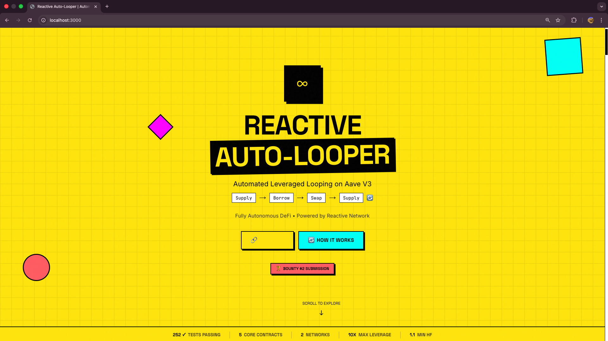

The landing page features a vibrant yellow-themed design with:
- **Reactive Auto-Looper branding** with the chain link icon
- **Tagline**: "Automated Leveraged Looping on Aave V3"
- **Workflow visualization**: Supply → Borrow → Swap → Supply cycle
- **Call-to-action buttons**: Connect wallet and "How It Works"
- **Bounty #2 Submission badge** linking to the bounty details
- **Animated geometric shapes** (magenta square, coral circle, cyan rectangle) for visual interest

---

## 📊 Stats & How It Works

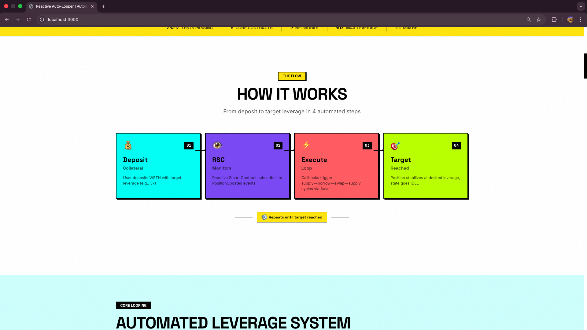

### Stats Bar
A horizontal bar displaying real-time metrics:
| Metric | Description |
|--------|-------------|
| **252 Tests Passing** | Full test coverage confirmation |
| **6 Core Contracts** | Number of deployed smart contracts |
| **3 Networks** | Sepolia, Lasna, and Reactive Network |
| **15x Max Leverage** | Maximum achievable leverage |
| **1.1 Min HF** | Minimum health factor before emergency unwind |

### How It Works Section
A step-by-step visual guide showing the automated looping process:

1. **User Deposits** - User calls `deposit()` with collateral and target leverage
2. **RSC Detects Event** - Reactive Smart Contract detects `PositionUpdated` event
3. **Callback Executed** - RSC emits callback to trigger `executeLoopStep()`
4. **Loop Iteration** - Supply → Borrow → Swap → Supply cycle executes
5. **Target Reached** - Loop continues until target leverage is achieved

---

## ⚡ Features Showcase

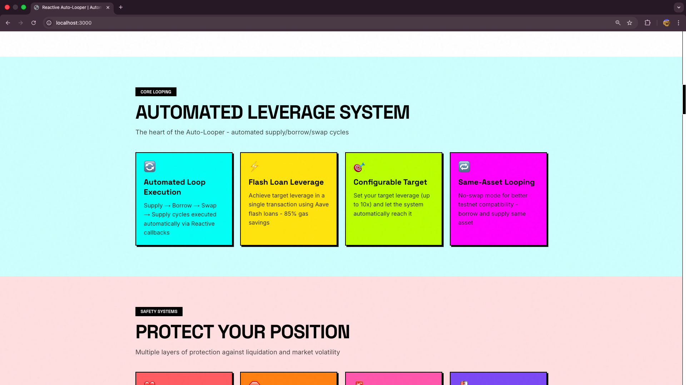

The features section highlights the core capabilities with colorful cards:

| Feature | Color | Description |
|---------|-------|-------------|
| **Flash Loan Mode** | 🟢 Green | Instant leverage in a single transaction with ~85% gas savings |
| **Health Factor Guardian** | 🔴 Red | Automatic emergency unwind when HF drops below 1.1 |
| **Self-Sustaining Gas** | 🟡 Yellow | Reactivate pattern for automatic RSC funding |
| **Same-Asset Loop** | 🔵 Blue | Bypass DEX liquidity by borrowing the same asset |
| **Take-Profit/Stop-Loss** | 🟣 Purple | Automatic triggers at price targets |
| **CRON Health Checks** | 🟠 Orange | Periodic batch monitoring every ~100 blocks |

---

## 📈 Interactive Dashboard

The dashboard provides real-time interaction with deployed contracts across three tabs:

### System Status Tab
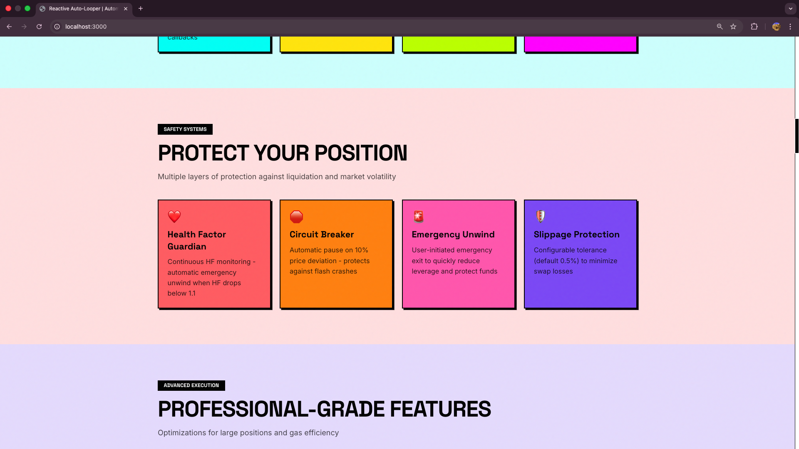

Query the current state of the Auto-Looper system:

| Card | Data Displayed |
|------|----------------|
| **Manager Contract** | Paused state, circuit breaker status, fees |
| **Health Check** | Contract deployment verification |
| **Callback Reserves** | ETH reserves for RVM callbacks |
| **Funder Balance** | Self-sustaining gas fund balance |

### Live System Status
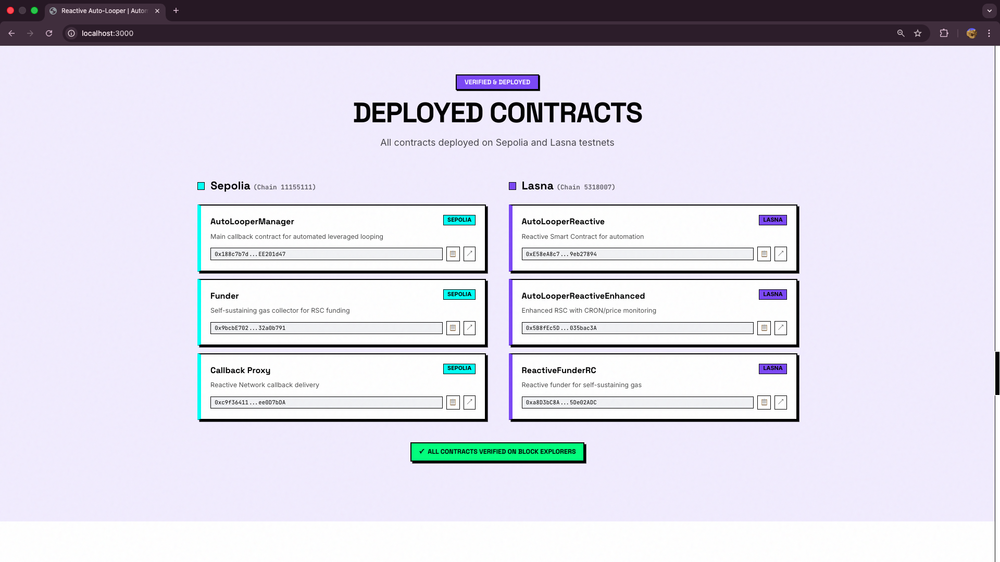

When connected and loaded, displays:
- ✅ **Contract Active** - Manager is not paused
- 🔒 **Circuit Breaker** - Enabled/Disabled status
- 💰 **Reserves** - Current callback proxy reserves
- 📊 **Fee Structure** - Loop and flash loan fees

### Position Lookup Tab
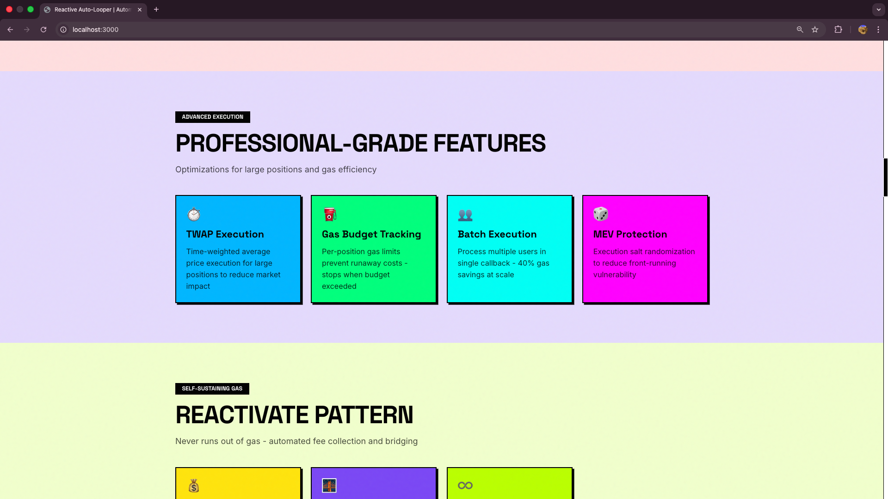

Enter any Ethereum address to query their position:
- Input field for wallet address
- "Lookup Position" button to query on-chain data

### Position Results
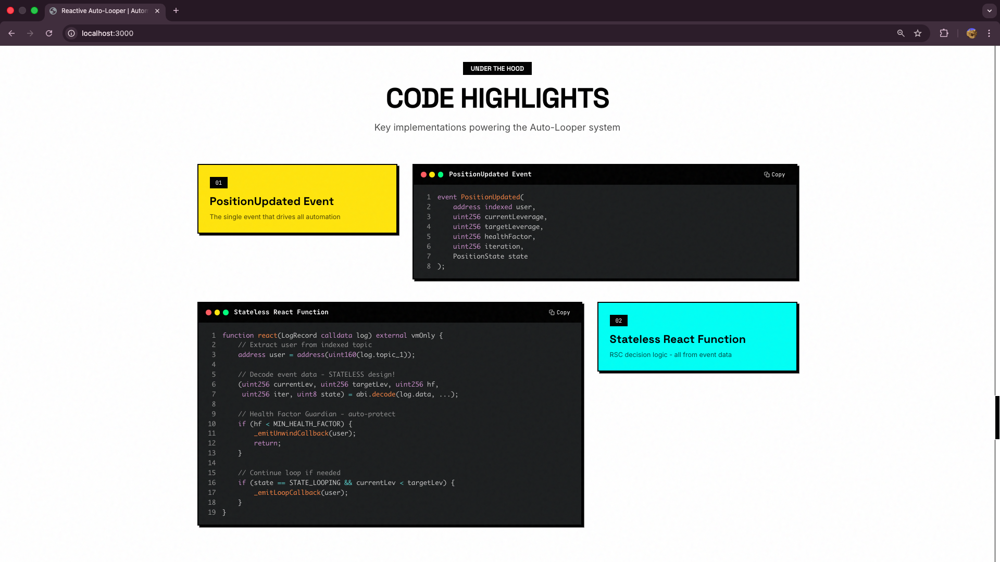

When a position is found, displays comprehensive data:

| Field | Description |
|-------|-------------|
| **State** | IDLE, LOOPING, UNWINDING, or EMERGENCY |
| **Current Leverage** | Current leverage ratio (e.g., 4.04x) |
| **Target Leverage** | User's target leverage (e.g., 1.50x) |
| **Health Factor** | Current HF with safety indicator |
| **Collateral Asset** | Token being used as collateral |
| **Borrow Asset** | Token being borrowed |
| **Iterations** | Current/Max iteration count |
| **Flash Loan** | Whether flash loan mode is enabled |

### RVM Status Tab
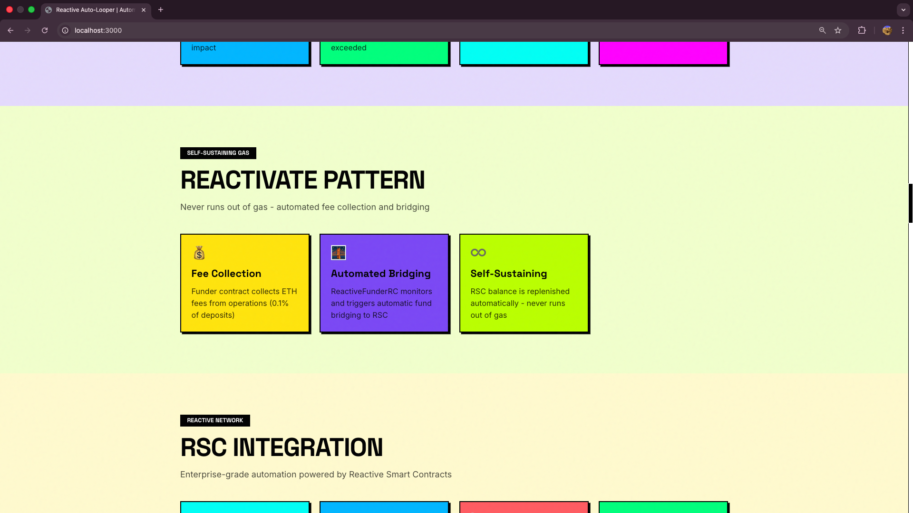

Monitor the Reactive Virtual Machine status:
- **RVM Address** - The reactive contract address
- **Free Balance** - Available REACT for operations
- **Debt Status** - Any outstanding RVM debt

### RVM Details
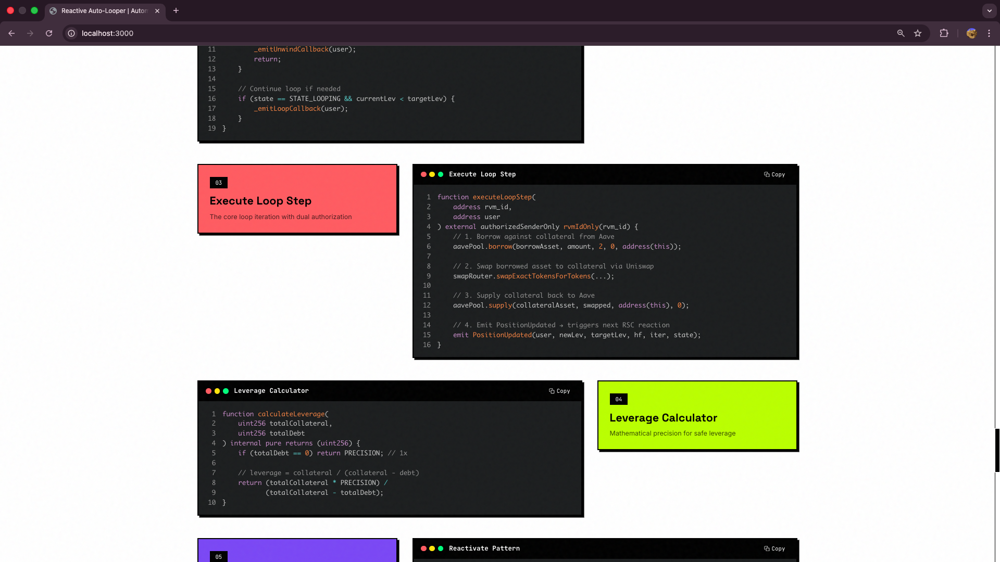

Detailed RVM information including:
- Subscription status
- Event processing stats
- Debt management status

---

## 🛠️ Tech Stack

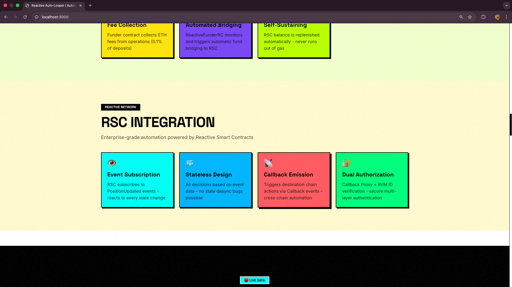

Showcases the technologies powering the system with official logos:

| Technology | Category | Description |
|------------|----------|-------------|
| **Reactive Network** | Core | Event-driven blockchain infrastructure |
| **Aave V3** | DeFi | Decentralized lending protocol |
| **Uniswap V2** | DeFi | Decentralized exchange for swaps |
| **Foundry** | Development | Smart contract development framework |
| **Solidity** | Language | Smart contract programming language |
| **Next.js** | Frontend | React framework for the web interface |
| **TypeScript** | Language | Type-safe JavaScript |
| **TailwindCSS** | Styling | Utility-first CSS framework |

### Extended Tech Stack
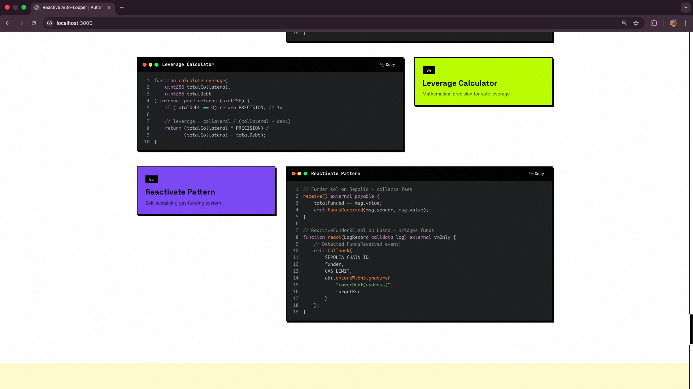

Additional technologies including:
- **Ethers.js** - Ethereum library
- **OpenZeppelin** - Security libraries
- **Telegram Bot API** - Monitoring notifications

---

## 📋 Deployed Contracts

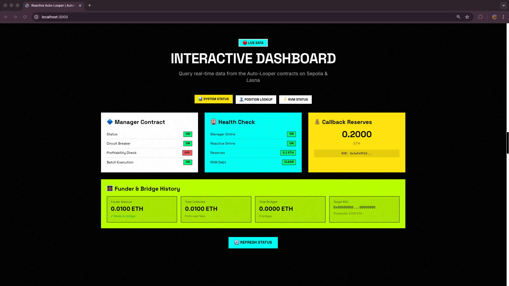

Interactive contract explorer with direct links:

| Contract | Network | Explorer Link |
|----------|---------|---------------|
| **AutoLooperManager** | Sepolia | [Etherscan](https://sepolia.etherscan.io/address/0x188c7b7dC3EEbCA58371abC8D62cB62bEE201d47) |
| **AutoLooperReactive** | Lasna | [ReactScan](https://lasna.reactscan.net/address/0xE58eA8c7eC0E47D195f720f34b3187F59eb27894) |
| **AutoLooperReactiveEnhanced** | Lasna | [ReactScan](https://lasna.reactscan.net/address/0x5B8fEc5DBBE29d0B52141e51d407aDf8035bac3A) |
| **Funder** | Sepolia | [Etherscan](https://sepolia.etherscan.io/address/0x9bcbE702215763e2D90BE8f3a374a41a32a0b791) |
| **ReactiveFunderRC** | Lasna | [ReactScan](https://lasna.reactscan.net/address/0xa8D3bC8A55Cf854b3184C6bEaF09aE795De02ADC) |
| **Callback Proxy** | Sepolia | [Etherscan](https://sepolia.etherscan.io/address/0xc9f36411C9897e7F959D99ffca2a0Ba7ee0D7bDA) |

### Contract Explorer
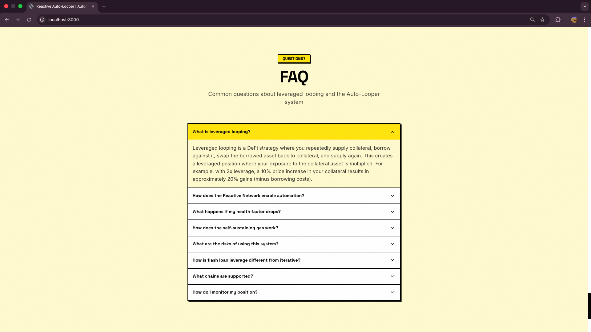

Each contract card includes:
- Contract name and description
- Network badge (Sepolia/Lasna)
- Copy address button
- Direct explorer link

---

## 💻 Code Highlights

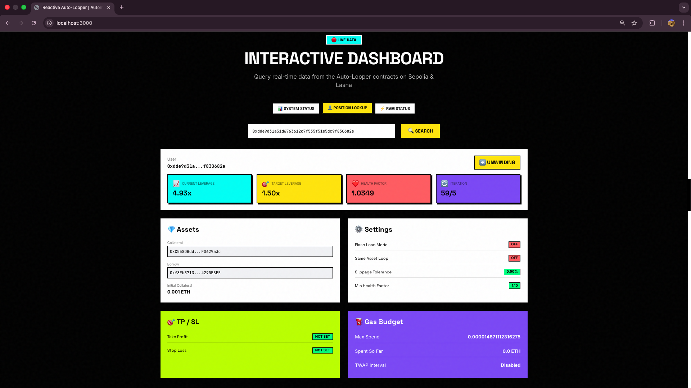

Interactive code snippets showcasing key functionality:

### Deposit Function
```solidity
function deposit(
    address collateralAsset,
    address borrowAsset,
    uint256 amount,
    uint256 targetLeverage,
    uint256 maxIterations,
    bool useFlashLoan
) external payable;
```

### Loop Execution
```solidity
function executeLoopStep(address user) external;
```

### Health Factor Guardian
```solidity
if (healthFactor < MIN_HEALTH_FACTOR) {
    emit EmergencyUnwindTriggered(user, healthFactor);
    _executeUnwind(user);
}
```

---

## ❓ FAQ Section

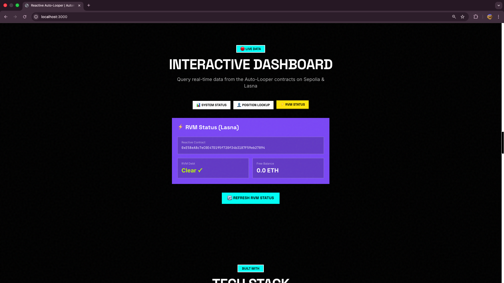

Expandable FAQ accordion with common questions:

| Question | Summary |
|----------|---------|
| What is leveraged looping? | Strategy to increase exposure by recursively borrowing and supplying |
| How does the automation work? | RSC detects events and triggers callbacks automatically |
| What are the risks? | Liquidation if health factor drops too low |
| How is gas handled? | Self-sustaining Reactivate pattern funds the RSC |
| Can I emergency exit? | Yes, call `emergencyWithdraw()` at any time |

---

## 🦶 Footer

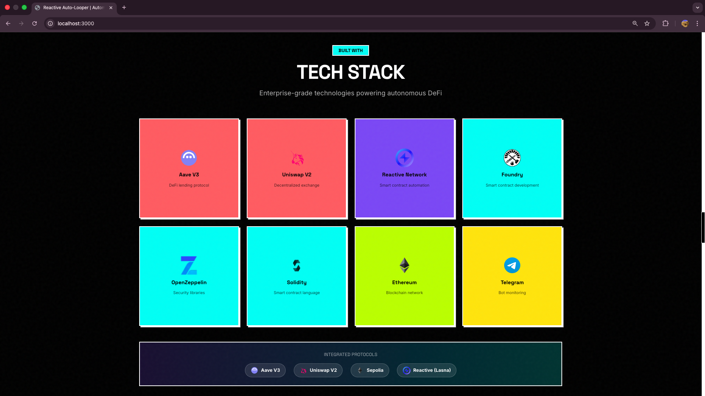

The footer includes:

### Navigation Links
- Documentation
- GitHub Repository
- API Reference
- Contract Addresses

### Social Links
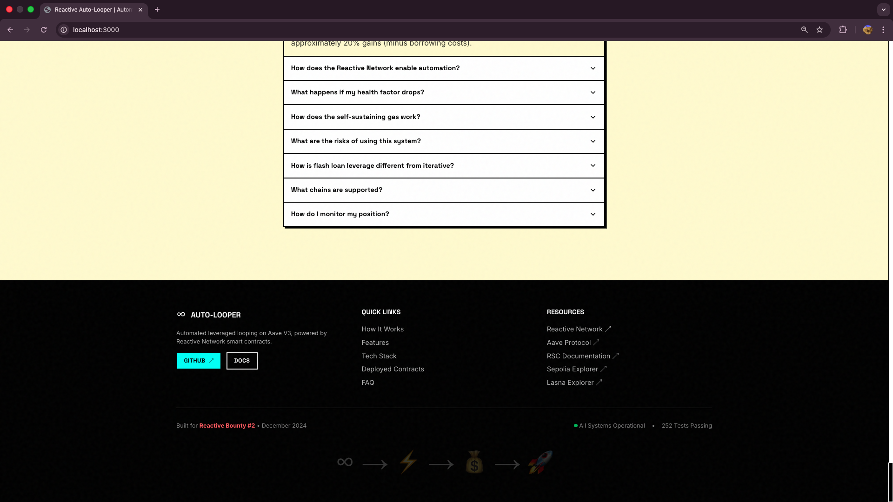

- Twitter/X
- Discord
- Telegram Bot
- Medium Blog

### Legal
- Privacy Policy
- Terms of Service
- MIT License

---

## 🚀 Running Locally

### Prerequisites
- Node.js 18+
- npm or yarn

### Installation

```bash
# Navigate to frontend directory
cd reactive-auto-looper/frontend

# Install dependencies
npm install

# Create environment file
cp .env.example .env.local

# Edit .env.local with your RPC URLs
# SEPOLIA_RPC_URL=https://eth-sepolia.g.alchemy.com/v2/YOUR_KEY
# REACTIVE_RPC_URL=https://lasna-rpc.rnk.dev

# Start development server
npm run dev
```

### Environment Variables

| Variable | Description | Required |
|----------|-------------|----------|
| `SEPOLIA_RPC_URL` | Sepolia RPC endpoint (server-side) | Yes |
| `REACTIVE_RPC_URL` | Lasna RPC endpoint (server-side) | Yes |
| `NEXT_PUBLIC_SITE_URL` | Site URL for SEO | No |

### Build for Production

```bash
npm run build
npm start
```

---

## 📁 Project Structure

```
frontend/
├── src/
│   ├── app/
│   │   ├── api/              # API routes (server-side)
│   │   │   ├── funder/       # Funder balance endpoint
│   │   │   ├── health/       # Contract health check
│   │   │   ├── position/     # Position lookup
│   │   │   ├── rvm/          # RVM status
│   │   │   └── status/       # System status
│   │   ├── globals.css       # Global styles
│   │   ├── layout.tsx        # Root layout
│   │   └── page.tsx          # Home page
│   ├── components/
│   │   ├── sections/         # Page sections
│   │   │   ├── Hero.tsx
│   │   │   ├── HowItWorks.tsx
│   │   │   ├── Features.tsx
│   │   │   ├── Dashboard.tsx
│   │   │   ├── TechStack.tsx
│   │   │   ├── DeployedContracts.tsx
│   │   │   ├── CodeHighlights.tsx
│   │   │   ├── FAQ.tsx
│   │   │   └── Footer.tsx
│   │   └── ui/               # Reusable UI components
│   │       ├── StatsBar.tsx
│   │       ├── Button.tsx
│   │       └── Card.tsx
│   └── lib/
│       ├── blockchain.ts     # Blockchain utilities
│       └── constants.ts      # App constants
├── public/                   # Static assets
├── tailwind.config.ts        # TailwindCSS config
└── package.json
```

---

## 🎨 Design System

### Colors
| Name | Hex | Usage |
|------|-----|-------|
| Primary Yellow | `#FFE500` | Hero background, accents |
| Accent Cyan | `#00E5FF` | Buttons, highlights |
| Accent Magenta | `#FF00FF` | Decorative elements |
| Dark Background | `#0A0A0A` | Dashboard, sections |
| Card Background | `#1A1A1A` | Cards, panels |

### Typography
- **Headings**: Outfit (Google Fonts)
- **Body**: Inter (Google Fonts)
- **Code**: JetBrains Mono

### Components
- Glassmorphism cards with subtle blur
- Gradient borders on interactive elements
- Smooth hover animations
- Responsive design (mobile-first)

---

## 📄 License

MIT License - see [LICENSE](../LICENSE) for details.
